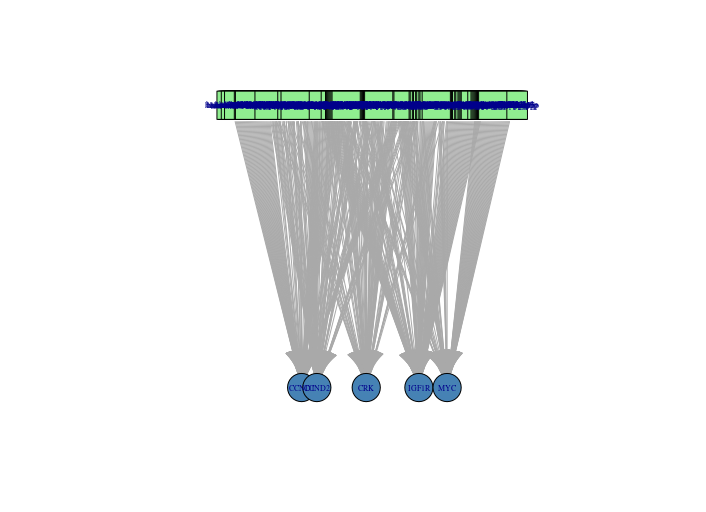
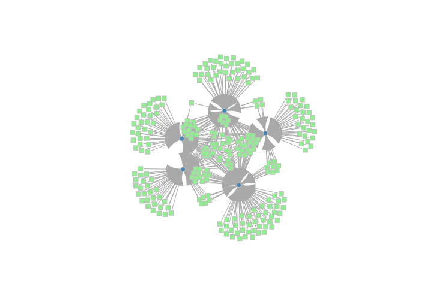
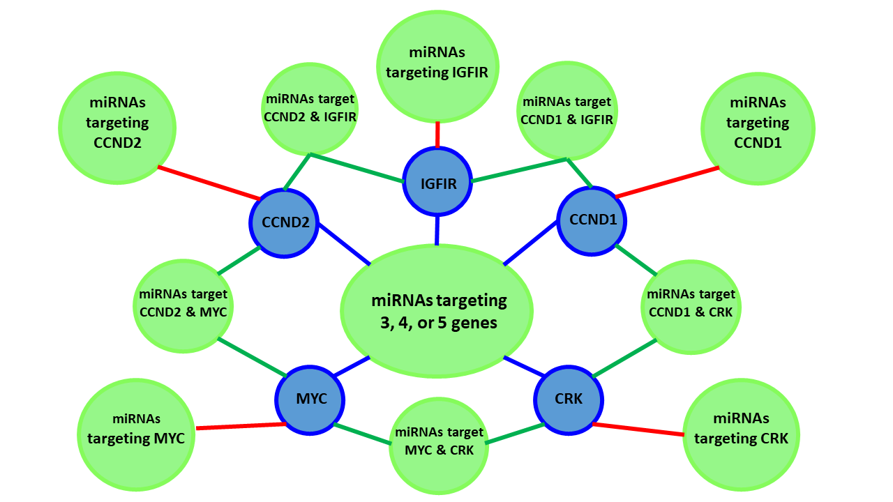
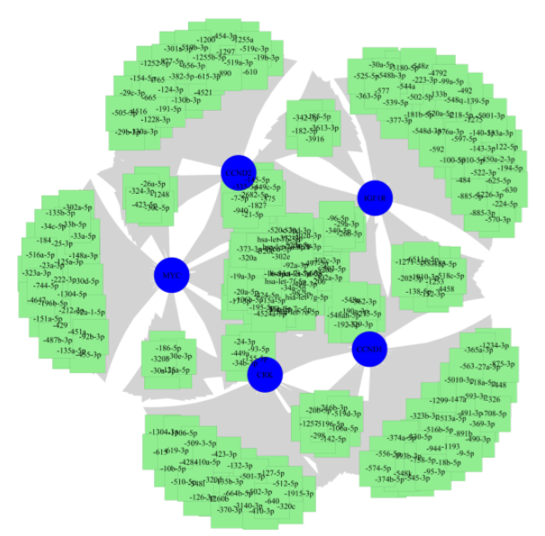

<h1 align="center">
Analyze Networks and Pathways</h1>

Ms. Kathryn Hogan, BTEC 495 intern 
Dr. Jeffrey Robinson, BTEC 495 project adviser

The project is part of UMBC's BTEC495 Professional Internship and Project-based Research Experience, Ms. Hogan is a student in the [Translational Life Science Technology (TLST) program](http://shadygrove.umbc.edu/tlst.php) at Universities at Shady Grove Campus.

<h2 align="left">
Description of the project
</h2>

<h2 align="left">
Introduction
</h2>

  MicroRNAs are small non-coding RNAs that are known to perform many vital post-transcriptional regulatory steps of gene expression. MicroRNAs also play a role in many other cellular processes such as apoptosis, proliferation, or differentiation and perform regulation through either the inhibition of translation or the degradation of a transcript. Therefore, dysregulation of miRNAs may lead to a range of diseases.Continuing, the human genome encodes more than 200,000 transcripts and approximately 2,600 mature miRNAs. Hence, a single miRNA may target many different mRNAs and single mRNA may bind to various miRNAs, either simultaneously or in a context-dependent fashion. However, it is common for target regions of specific miRNAs to cluster together resulting in the cooperative repression effect. As a result, the mapping out of miRNA–mRNA interactions is notably difficult and far from being complete.
  Therefore, analysis of miRNA and mRNA interactions reveals insight into meaningful pathways and potentially new factors influencing a wide range of diseases. In a study performed by Robinson et al., data from the NCBI GEO database series GS132501 were subject to analyses in R studio to create visualizations of mRNA expression data from four miR-mimic treatments. The visualizations produced included clustering and principal components analysis (PCA), differential expression volcano plots, heatmaps of pathway scores, and miRNA biogenesis pathway results. The data analysis illustrated in this report represents results from the Advanced Analysis Module 2.0 plugin and Nanostring nSolver 4.0 software. 
Furthermore, in another study performed by Robinson et al. a network model was developed that recognizes hypothetical co-regulatory motifs in a miRNA–mRNA interaction network. KEGG and miRWalk2.0 databases were utilized to create a list of mRNA-miRNA interactions that may play a role in the regulation of intestinal epithelial barrier function. In addition, an R-code was developed to aid the visualization and evaluation of these recorded interactions. Visualizations produced from this R-code include bar graphs, network plots, and a table. Robinson et al. describe in detail the attributes of this network and its most targeted genes and what the results may indicate, as well as the hypothetical role this miRNA-mRNA network plays. In addition, in a study performed by Joseph PV, et al., a signaling network was created after a miRNA mimic of each MetS-FL miR trio (hsa-miR-142-3p, hsa-miR-18b, and hsa-miR-890) was transfected into either CRL-1790 or Caco-2 human colorectal cells using a method known as lipofection. Researchers utilized Occludin and Zona Occludens-1/ZO-1 immunofluorescence staining-confocal microscopy, transepithelial electrical resistance (TEER), and nCounter® Human v3 miRNA, NanoString Technologies to evaluate alterations in the barrier and epithelial cell junction structure. Visualizations such as a network plot and the Log2 counts of untransfected cells were developed. Joseph PV, et al. describes changes in many miRNAs expression, structural modifications, as well as a signaling network associated with factors that are linked to injury, inflammation, and hyperplasia.
  In this study, we aggregated data from the sources cited above as well as from the NCBI databases on human miRNA–mRNA interactions and then investigated how miRNAs target specific mRNAs of certain genes and the resulting networks of these interactions. In order to do this, we developed a code in R studio to further analyze these miRNA-mRNA interactions and develop visualizations to illustrate this network. The visualizations created to illustrate these interactions include density plots, bipartite mapping plots, and a bipartite-specific plot.

<h2 align="left">
Methods
</h2>

<h2 align="left">
Results
</h2>

### Histograms: 

### miRNA Targets per mRNA: Density Plot

### mRNA Targets per mRNA: Density Plot

### Bipartite Mapping:
| miRNAs Targeting Genes | miRNAs Targeting Genes in R |
  | --- | --- |
  |  |  |
  
  
<h2 align="left">  
Supporting Images
</h2>

### Graphics: 

### NanoString miRNA Hybridization

<h2 align="left">
Citations:
</h2>

Reinhold, et al. 2017. [The NCI-60 Methylome and its integration into CellMiner Database](https://cancerres.aacrjournals.org/content/77/3/601). Cancer Research. DOI: 10.1158/0008-5472.CAN-16-0655.

Reinhold, et al. 2012. CellMiner: A Web-Based Suite of Genomic and Pharmacologic Tools to Explore Transcript and Drug Patterns in the NCI-60 Cell Line Set. Cancer Research.72(14). DOI: 10.1158/0008-5472.CAN-12-1370. 

Chartrand G, Zhang P. 2012. A First Course in Graph Theory. Dover Publications, Inc. Mineola NY.

Joseph PV, et al. 2018. Colon Epithelial MicroRNA Network in Fatty Liver. Canadian Journal of Gastroenterology and Hepatology. 2018:8246103. PMID:30345259.

Lamouille S, Xu J, Derynck R. 2014. Molecular mechanisms of epithelial-mesenchymal transition. Nature Reviews Molecular Cell Biology. 15:179-196. 

Needham M, Hodler AE. 2019. Graph Algorithms Practical Examples in Apache Spark & Neo4j. O'REILLY. Boston MA.

Robinson JM. 2020. Differential gene expression and functional pathway enrichment in colon cell line CCD 841 CoN (CRL-1790) transfected with miR-mimics miR-18b, miR-142-3p, mir-155, and miR-890.  BioRxiv. DOI: http://dx.doi.org/10.1101/747931.

Robinson JM, Henderson WA. 2018. Modelling the structure of a ceRNA-theoretical, bipartite microRNA-mRNA interaction network regulating intestinal epithelial celluar pathways using R programming.  BMC Research Notes. 11:19. DOI: https://doi.org/10.1186/s13104-018-3126-y.

<h2 align="left">
Source code adapted for the project:
</h2>  

[Bipartite/Two-Mode Networks in igraph](https://rpubs.com/pjmurphy/317838)

