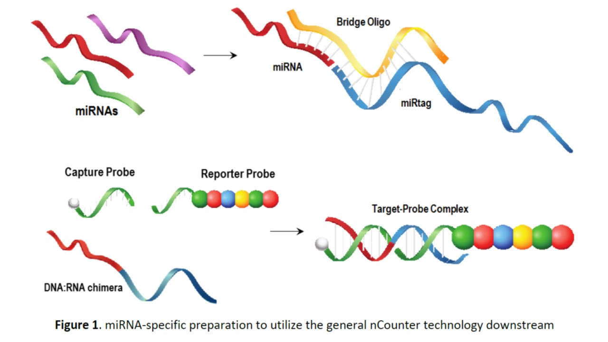

<h1 align="center">
Analyze Networks and Pathways</h1>

Ms. Kathryn Hogan, BTEC 495 intern 
Dr. Jeffrey Robinson, BTEC 495 project adviser

The project is part of UMBC's BTEC495 Professional Internship and Project-based Research Experience, Ms. Hogan is a student in the [Translational Life Science Technology (TLST) program](http://shadygrove.umbc.edu/tlst.php) at Universities at Shady Grove Campus.

<h2 align="left">
Description of the project
</h2>

<h2 align="left">
Introduction
</h2>

<h2 align="left">
Methods
</h2>

<h2 align="left">
Results
</h2>

### Histograms: 

### miRNA Targets per mRNA: Density Plot

### mRNA Targets per mRNA: Density Plot

### Bipartite Mapping:
| miRNAs Targeting Genes in R | miRNAs Targeting Genes |
  | --- | --- |
  |  |  |
  
  
<h2 align="left">  
Supporting Images
</h2>

### Graphics: 

### NanoString miRNA Hybridization

<h2 align="left">
Citations:
</h2>

Reinhold, et al. 2017. [The NCI-60 Methylome and its integration into CellMiner Database](https://cancerres.aacrjournals.org/content/77/3/601). Cancer Research. DOI: 10.1158/0008-5472.CAN-16-0655.

Reinhold, et al. 2012. CellMiner: A Web-Based Suite of Genomic and Pharmacologic Tools to Explore Transcript and Drug Patterns in the NCI-60 Cell Line Set. Cancer Research.72(14). DOI: 10.1158/0008-5472.CAN-12-1370. 

Chartrand G, Zhang P. 2012. A First Course in Graph Theory. Dover Publications, Inc. Mineola NY.

Joseph PV, et al. 2018. Colon Epithelial MicroRNA Network in Fatty Liver. Canadian Journal of Gastroenterology and Hepatology. 2018:8246103. PMID:30345259.

Lamouille S, Xu J, Derynck R. 2014. Molecular mechanisms of epithelial-mesenchymal transition. Nature Reviews Molecular Cell Biology. 15:179-196. 

Needham M, Hodler AE. 2019. Graph Algorithms Practical Examples in Apache Spark & Neo4j. O'REILLY. Boston MA.

Robinson JM. 2020. Differential gene expression and functional pathway enrichment in colon cell line CCD 841 CoN (CRL-1790) transfected with miR-mimics miR-18b, miR-142-3p, mir-155, and miR-890.  BioRxiv. DOI: http://dx.doi.org/10.1101/747931.

Robinson JM, Henderson WA. 2018. Modelling the structure of a ceRNA-theoretical, bipartite microRNA-mRNA interaction network regulating intestinal epithelial celluar pathways using R programming.  BMC Research Notes. 11:19. DOI: https://doi.org/10.1186/s13104-018-3126-y.

<h2 align="left">
Source code adapted for the project:
</h2>  

[Bipartite/Two-Mode Networks in igraph](https://rpubs.com/pjmurphy/317838)

