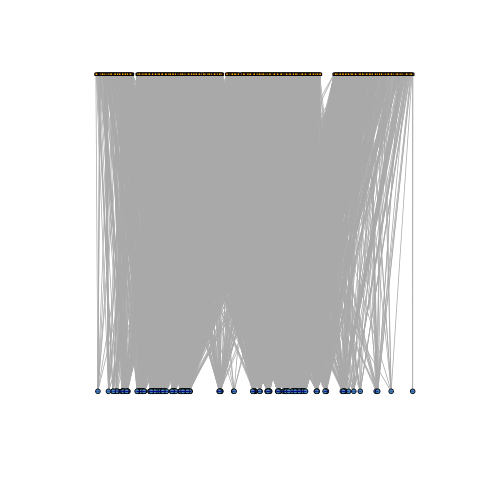

[](https://zenodo.org/badge/latestdoi/278665845)
<h1 align="center">
MolGraphs: Molecular Interaction Networks </h1>

Dr. Jeffrey Robinson, BTEC 495 project supervisor<br>
Ms. Kathryn Hogan, BTEC 495 intern (Fall 2020/Spring 2021)<br>

Research interns include students from UMBC's BTEC495 "Professional Internship and Project-based Research Experience", from the [Translational Life Science Technology (TLST) program](http://shadygrove.umbc.edu/tlst.php) at Universities at Shady Grove Campus.  Additional informatics support is donated by Robinson Scientifics LLC.

## A. Molecular Interaction Networks 
Within cells and biological systems, biomolecules form a vast number of context-dependent interactions which may be appropriately modeled as networks subject to the mathematical properties described by Graph Theory (Chartrand and Zhang, 2012).  Among the most commonly studied include protein-protein, protein-DNA, and miRNA-mRNA interaction networks.  Here we focus on development of a workflow for analysis of miRNA-mRNA interaction networks, which interact in a bipartite-like network.  Biologically, miRNAs bind to complementary target sites on mRNAs and inhibit subsequent protein expression, in a manner affected by the relative abundance of miRNAs and mRNA target sites in a phenomenon named 'competing endogenous RNA (ceRNA)'.  Specifically, we will use this workflow to investigate how network properties are affected by changes in expression levels of mRNAs and miRNAs.

## B. Experimental Data
1. CRL1790 (a fetal colon epithelial-like cell line).  Both mRNA and miRNA datasets were derived from the same RNA samples.  The data is limited in scope, in regards to the 800 miRNAs and 250 mRNAs present in the Nanostring probe panels.

    a. <b>miRNA expression (Nanostring).</b> "miRNA expression in CTRL1790 cells transfected with miR mimics".<br>
    <em>GEO Series</em>: "GSE133586", https://www.ncbi.nlm.nih.gov/geo/query/acc.cgi?acc=GSE133586. <br>
    <em>Platform</em>: "GPL22634 NanoString Human miRNA version 3", https://www.ncbi.nlm.nih.gov/geo/query/acc.cgi?acc=GPL22634. <br>
    <em>Publication</em>: (Joseph et al. 2018)<br>
    
    b. <b>mRNA expression (Nanostring).</b> "Pathway-Associated Gene Expression in Gastrointestinal Cell Lines Under Conditions of Culture Age, Dexamethasone Exposure, and miRNA Overexpression". <br>
    <em>GEO Series</em>: GSE132501, https://www.ncbi.nlm.nih.gov/geo/query/acc.cgi?acc=GSE132501. <br>
    <em>Platform</em>: GPL2674 "custom Nanostring probe panel", https://www.ncbi.nlm.nih.gov/geo/query/acc.cgi?acc=GPL26764. <br>
    <em>Bioproject</em>: PRJNA548189, https://www.ncbi.nlm.nih.gov/bioproject/PRJNA548189 <br>
    <em>Publication</em>: (Robinson 2019a)<br>

## C. Computational Models
1. miRNA-mRNA experimentally validated interactions for the Nanostring subset was retrieved from MirWalk2.0 database.<br>
2. Code for producting X- and Y- projections of bipartite graphs from the  (Robinson & Henderson 2018). <br> 

## D. Descriptive statistics for a bipartite miRNA-mRNA interaction network.
<b>1. Summarizing miRNA-mRNA interactions: Histograms.</b>
The histogram plots display the distributions of experimentally-validated miRNA-mRNA target interactions from their two perspectives:  1. The number of mRNAs targeted by each individual miRNA, and 2. The number of miRNAs targeting each individual mRNA. The experimentally-validated interaction data was obtained from the MirWalk2.0 database, and then subset for mRNAs and miRNAs contained within our Nanostring expression panels. 

```
## Export the histogram as .png
png("../Fig_Output/H1.png")
H1 <- hist(miRTable, freq=FALSE, 
           main = "mRNA targets per miRNA: Density Plot", xlab = "# of mRNAs targeted", breaks=20, col = "lightgreen")

curve(dnorm(x, mean=mean(miRNA.freq), sd=sd(miRNA.freq)), add=TRUE, col="blue", lwd=2)
print(H1)
dev.off()
```
| mRNA <- miRNA        | miRNA <- mRNA           | 
| ------------- |:-------------:| 
|       |  | 

<b>2. Create the Graph dataframe, bipartite annotations, and network plots </b>

```
## Create a graph dataframe
gNT <- graph.data.frame(nt)
gNT <- as.undirected(gNT, mode = c("collapse", "each", "mutual"),
                     edge.attr.comb = igraph_opt("edge.attr.comb"))

## Create bipartite mapping
bipartite.mapping(gNT)
V(gNT)$type <- bipartite_mapping(gNT)$type

## Create network plots
gNTplot <- plot(gNT)
gNTbipart <- plot(gNT, layout=layout.bipartite)

```

| | Full Network (196 mRNAs - 657 miRNAs)       | Subset Network (5 mRNAs - 261 miRNAs)          | 
| ------------- | ------------- |:-------------:| 
|Standard Representation|       |  | 
|Bipartite mapping|       |  | 


<b>3. Graph Centrality Metrics (degree, betweenness, closeness, eigen centrality) </b>

```
types <- V(g)$type                 ## getting each vertex `type` let's us sort easily
deg <- degree(g)
bet <- betweenness(g)
clos <- closeness(g)
eig <- eigen_centrality(g)$vector

cent_df <- data.frame(types, deg, bet, clos, eig)

head(cent_df)
write.table(summary(cent_df), file="Subset.csv", sep=",")

```


|  Degree  |  Betweeness  | 
| ------------- | ------------- |
|      |   |


| Closeness |  Eigen Centrality  |
| ------------- | ------------- |
|  |   | 


<b>4. Results on the differential centrality of miRNA-mRNA interaction networks </b>

When we examine networks with smaller subsets of mRNA members, the network structure takes on several observed characteristics. Degree, betweeness, and eigen centrality increase in the mRNAs as expected, while the respective miRNA metrics vary only slightly.  In the closeness metric, both mRNA and miRNA show a large increase.  


##

<h2 align="left">
Citations:
</h2>

Chartrand G, Zhang P. 2012. A First Course in Graph Theory. Dover Publications, Inc. Mineola NY.

Joseph PV, et al. 2018. Colon Epithelial MicroRNA Network in Fatty Liver. Canadian Journal of Gastroenterology and Hepatology. 2018:8246103. PMID:30345259.

Reinhold, et al. 2012. CellMiner: A Web-Based Suite of Genomic and Pharmacologic Tools to Explore Transcript and Drug Patterns in the NCI-60 Cell Line Set. Cancer Research.72(14). DOI: 10.1158/0008-5472.CAN-12-1370. 

Robinson JM. 2019a. Differential gene expression and functional pathway enrichment in colon cell line CCD 841 CoN (CRL-1790) transfected with miR-mimics miR-18b, miR-142-3p, mir-155, and miR-890.  BioRxiv. DOI: https://www.biorxiv.org/content/10.1101/747931v2.

Robinson JM. 2019b. Comparative pathway enrichment analysis in gastrointestinal cell lines Caco-2, HT-29, HEPG2, and colon fibroblasts using a custom expression panel for tight-junction and cytoskeletal regulatory genes. bioRxiv. DOI: https://doi.org/10.1101/747105. 

Robinson JM, Henderson WA. 2018. Modelling the structure of a ceRNA-theoretical, bipartite microRNA-mRNA interaction network regulating intestinal epithelial celluar pathways using R programming.  BMC Research Notes. 11:19. DOI: https://doi.org/10.1186/s13104-018-3126-y.

<h2 align="left">
Adapted source code resources:
</h2>  

[Murphy & Knapp. Bipartite/Two-Mode Networks in igraph. RPubs.com](https://rpubs.com/pjmurphy/317838)

[Ognayova. Network Analysis and Visualization with R and igraph. Kateto.net](https://kateto.net/netscix2016.html)
