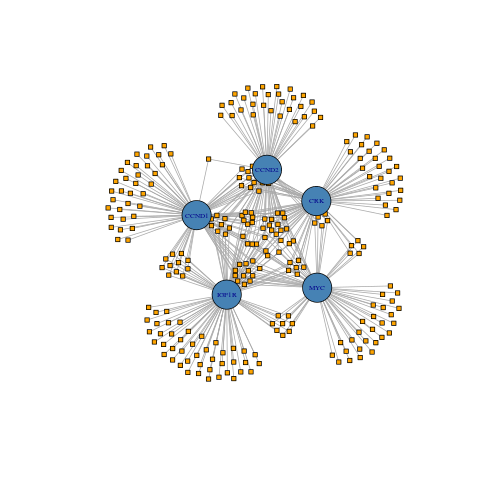

<h1 align="center">
Analyze Networks and Pathways</h1>

Dr. Jeffrey Robinson, BTEC 495 project supervisor<br>
Ms. Kathryn Hogan, BTEC 495 intern (Fall 2020/Spring 2021)<br>

The project contains work performed by students from UMBC's BTEC495 Professional Internship and Project-based Research Experience as part of  [Translational Life Science Technology (TLST) program](http://shadygrove.umbc.edu/tlst.php) at Universities at Shady Grove Campus.  Data utilized from Robinson's NIH postdoctoral research projects (see references).  Additional informatics support provided by Robinson Scientifics LLC.

## A. Networks and Pathways

Bioinformatic analysis is key to the interpretation of -omics data.  Network and pathway analyses can elucidate the various functional molecular interactions occurring at the molecular and cellular level.  These analyses take many forms, in general the most common types of analyses for -omics data include:

<b>1. Molecular interaction networks.</b>  

A large abundance of yeast-2-hybrid data from the 2000's yielded the ability to model and validate protein-protein interaction networks at proteome-scale.  During the 2010's, significant miRNA-mRNA interaction data has become available through RNA-immunoprecipitation/RNA-seq studies("RIP-seq").  These studies use Argonaute immunoprecipitation with RNA-seq to develop a transcriptome-wide model for miRNA-mRNA interactions in biological context.  Data on both bioinformatically predicted and experimentally validated miRNA-mRNA interactions are available as large aggregated datasets from the MirWalk2.0 database.  

Both protein-protein and miRNA-mRNA interaction networks form data structures that lend themselves to analysis using Graph Theory mathematics.  While Graph Theory has seen hugely successful application to social networks analysis, it is less intesively applied to molecular interaction networks, and therefore development of such applications represents a growth area.

<b>2. Gene Ontology (GO) and pathway enrichment analysis.</b>
 
Genes are classified through the Gene Ontology (GO) system, where they are grouped by 1. Cellular Component, 2. Molecular Function, 3. Biological Process.  Further, genes are assigned pathway membership in several differen pathway schemes; common examples include the Kyoto Encyclopedia of Genes and Genomes (KEGG), and the Reactome pathway databases.  

In any given gene subset, or with the full genome, these categorization schemes can be tested for statistical enrichment against a null-case reference.  Although this provides a semi-quantification of functional molecular phenotype inferrence, these do not provide direct quantification of a global molecular mechanism in the same way as experimentally-derived molecular interaction networks described above.


<b>3. Gene regulatory network analysis (ie. transcription factor regulatory networks).</b>

## B. Network analysis of miRNA-mRNA interaction networks
 
<b>1. Summarizing miRNA-mRNA interactions: Histograms.</b>
(histogram code adapted from Robinson & Henderson (2018))

```
## Export the histogram as .png
png("../Fig_Output/H1.png")
H1 <- hist(miRTable, freq=FALSE, 
           main = "mRNA targets per miRNA: Density Plot", xlab = "# of mRNAs targeted", breaks=20, col = "lightgreen")

curve(dnorm(x, mean=mean(miRNA.freq), sd=sd(miRNA.freq)), add=TRUE, col="blue", lwd=2)
print(H1)
dev.off()
```
| mRNA <- miRNA        | miRNA <- mRNA           | 
| ------------- |:-------------:| 
|       |  | 

<b>2. Create the Graph dataframe, bipartite annotations, and network plots </b>

```
## Create a graph dataframe
gNT <- graph.data.frame(nt)
gNT <- as.undirected(gNT, mode = c("collapse", "each", "mutual"),
                     edge.attr.comb = igraph_opt("edge.attr.comb"))

## Create bipartite mapping
bipartite.mapping(gNT)
V(gNT)$type <- bipartite_mapping(gNT)$type

## Create network plots
gNTplot <- plot(gNT)
gNTbipart <- plot(gNT, layout=layout.bipartite)

```

| Full Network (196 mRNAs - 657 miRNAs)       | Subset Network (5 mRNAs - 261 miRNAs)          | 
| ------------- |:-------------:| 
|       |  | 
|       |  | 


<b>3. Graph Metrics (degree, betweenness, closeness, eigen centrality) </b>

```
types <- V(g)$type                 ## getting each vertex `type` let's us sort easily
deg <- degree(g)
bet <- betweenness(g)
clos <- closeness(g)
eig <- eigen_centrality(g)$vector

cent_df <- data.frame(types, deg, bet, clos, eig)

head(cent_df)
write.table(summary(cent_df), file="Subset.csv", sep=",")

```
   
| Degree | Betweeness | Closeness | Eigen Centrality |
| ------ | ---------- | --------- | ---------------- |
|       |  |       |  | 

   

##

<h2 align="left">
Citations:
</h2>

Chartrand G, Zhang P. 2012. A First Course in Graph Theory. Dover Publications, Inc. Mineola NY.


Joseph PV, et al. 2018. Colon Epithelial MicroRNA Network in Fatty Liver. Canadian Journal of Gastroenterology and Hepatology. 2018:8246103. PMID:30345259.


Needham M, Hodler AE. 2019. Graph Algorithms Practical Examples in Apache Spark & Neo4j. O'REILLY. Boston MA.

Reinhold, et al. 2017. [The NCI-60 Methylome and its integration into CellMiner Database](https://cancerres.aacrjournals.org/content/77/3/601). Cancer Research. DOI: 10.1158/0008-5472.CAN-16-0655.

Reinhold, et al. 2012. CellMiner: A Web-Based Suite of Genomic and Pharmacologic Tools to Explore Transcript and Drug Patterns in the NCI-60 Cell Line Set. Cancer Research.72(14). DOI: 10.1158/0008-5472.CAN-12-1370. 

Robinson JM. 2020. Differential gene expression and functional pathway enrichment in colon cell line CCD 841 CoN (CRL-1790) transfected with miR-mimics miR-18b, miR-142-3p, mir-155, and miR-890.  BioRxiv. DOI: http://dx.doi.org/10.1101/747931.

Robinson JM, Henderson WA. 2018. Modelling the structure of a ceRNA-theoretical, bipartite microRNA-mRNA interaction network regulating intestinal epithelial celluar pathways using R programming.  BMC Research Notes. 11:19. DOI: https://doi.org/10.1186/s13104-018-3126-y.

<h2 align="left">
Source code adapted for the project:
</h2>  

[Murphy & Knapp. Bipartite/Two-Mode Networks in igraph. RPubs.com](https://rpubs.com/pjmurphy/317838)

[Ognayova. Network Analysis and Visualization with R and igraph. Kateto.net](https://kateto.net/netscix2016.html)
